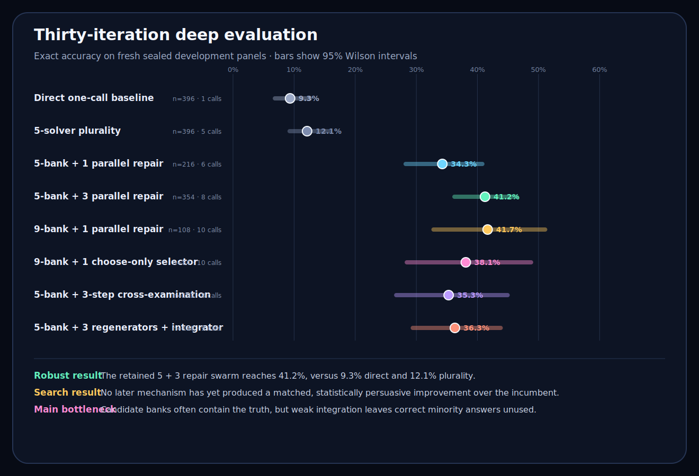

# Deep Evaluation After Iteration 30

## Verdict

The lab found a real orchestration effect, but it did not yet demonstrate that the outer search improves orchestration over time.

The retained five-solver, three-repair swarm reached **146/354 exact, or 41.2%**, across 27 fresh development panels. On those same cases, five-solver plurality reached **44/354, or 12.4%**, and a single Luna Light answer reached **33/354, or 9.3%**. The swarm's matched gain over plurality was **28.8 percentage points**.

That is strong adaptive-development evidence. It is not independent validation, and it does not yet establish transfer beyond this generator and model.

The outer search itself plateaued. The winning mechanism is operationally the same mechanism that appeared in Iteration 1. None of the later architectures produced a reliable matched improvement over it.

## Evaluation boundary

This audit uses only the canonical result files for Iterations 1 through 30. It excludes the quarantined false-zero Iteration 21 infrastructure attempt and its invalid downstream proposal.

- **30** distinct fresh panels
- **396** exact-verifiable problems
- **132** sequence, **132** planning, and **132** logic problems
- **7,535** valid Luna Light worker calls
- **7,591** transport attempts, including 56 recovered infrastructure retries
- **3,672** base-solver calls and **3,863** review or integration calls
- **2,376** scored strategy-case rows
- **0** repeated prompts and **0** invalid terminal worker outputs in the canonical run

The raw tables and reproducible standard-library analysis are in:

- [`analysis/iteration-030-summary.json`](analysis/iteration-030-summary.json)
- [`analysis/iteration-030-mechanisms.csv`](analysis/iteration-030-mechanisms.csv)
- [`analysis/iteration-030-paired.csv`](analysis/iteration-030-paired.csv)
- [`deep_evaluate.py`](deep_evaluate.py)

## Main mechanisms

Raw pooled results are descriptive because mechanisms entered and left the adaptive search on different panels. The matched comparisons below are more informative.

| Mechanism | Exact | 95% Wilson interval | Weakest family | Calls per case |
| --- | ---: | ---: | ---: | ---: |
| Direct one-call baseline | 37/396 = 9.3% | 6.9% to 12.6% | 3.8% | 1 |
| Five-solver plurality | 48/396 = 12.1% | 9.3% to 15.7% | 7.6% | 5 |
| Five-bank, three parallel repairs | 146/354 = 41.2% | 36.2% to 46.4% | 36.4% | 8.0 |
| Nine-bank, one parallel repair | 45/108 = 41.7% | 32.8% to 51.1% | 25.0% | 10 |
| Nine-bank, one choose-only selector | 32/84 = 38.1% | 28.4% to 48.8% | 35.7% | 10 |
| Regenerate, then integrate | 61/168 = 36.3% | 29.4% to 43.8% | 35.7% | 9.0 |
| Five-bank cross-examination | 36/102 = 35.3% | 26.7% to 44.9% | 29.4% | 7.9 |
| Five-bank, one parallel repair | 74/216 = 34.3% | 28.3% to 40.8% | 27.8% | 6.0 |

The champion's family results were:

- Sequence: **56/118 = 47.5%**
- Planning: **47/118 = 39.8%**
- Logic: **43/118 = 36.4%**

Logic remains the clearest weakness.

## Matched comparisons

Every comparison here uses cases on which both the challenger and incumbent ran.

| Challenger | Shared cases | Incumbent | Challenger | Difference | Paired exact p-value |
| --- | ---: | ---: | ---: | ---: | ---: |
| Five-bank, one repair | 204 | 37.7% | 35.8% | -2.0 points | .585 |
| Regenerate, then integrate | 168 | 41.1% | 36.3% | -4.8 points | .280 |
| Nine-bank, one repair | 108 | 43.5% | 41.7% | -1.9 points | .839 |
| Five-bank cross-examination | 102 | 36.3% | 35.3% | -1.0 point | 1.000 |
| Nine-bank, one selector | 84 | 39.3% | 38.1% | -1.2 points | 1.000 |

No later mechanism has a persuasive matched advantage. These p-values are descriptive because the mechanisms were selected adaptively, but they make the plateau difficult to dismiss as a pooling artifact.

By contrast, the champion versus matched five-vote plurality comparison is large: **146/354 versus 44/354**. The discordant cases were 107 champion-only wins and 5 plurality-only wins. That is a genuine and repeatable signal within this development environment.

The matched lift is 28.8 points, with a panel-clustered 95% interval of approximately **24.5 to 33.3 points**. The exact paired p-value is about 5 × 10⁻²⁶, although it remains descriptive because the champion was selected adaptively.

One challenger deserves continued attention despite the lack of statistical superiority. On the six panels shared by the nine-bank selector and incumbent, the selector had a better weakest-family result, 10/28 versus 7/28, while trailing by only one overall answer, 32/84 versus 33/84. Those family cells are still small, so this is a promising design clue rather than a promotion result.

## Did accuracy improve over iterations?

Not for a fixed deployable system.

The retained champion scored:

- Iterations 1 to 10: **45/102 = 44.1%**
- Iterations 11 to 20: **47/120 = 39.2%**
- Iterations 21 to 30: **54/132 = 40.9%**

There is no upward trend. The mechanism's first four panels were 21/48, or 43.8%, and its later panels were 125/306, or 40.8%.

The best strategy chosen after seeing each panel scored 44.7%, 43.9%, and 49.2% across the same three phases. That last number is mildly encouraging, but it is an optimistic per-panel selection ceiling, not the performance of a system that could be chosen before answers are revealed.

The 66.7% best single-panel result is also not a performance estimate. It was selected from 180 strategy-panel observations, and its 12-case confidence interval is extremely wide.

## What the search learned

### 1. Repair is much better than voting

Five-answer plurality was correct on only 12.4% of the champion's matched cases. The three falsifying repairers raised that to 41.2% through **107 helpful corrections and only 5 harmful reversals**.

The swarm works because reviewers are allowed to construct a corrected answer, not merely endorse the most popular candidate.

### 2. More candidate supply alone is not enough

On Iterations 25 through 30, expanding from five to nine base answers raised oracle coverage from **31/84 to 48/84**. The nine-bank selector nevertheless scored 32/84, while the five-bank champion scored 33/84 on the same cases.

Seventeen extra cases contained a correct candidate, but the selector failed to turn that added supply into better final accuracy.

### 3. Selection is usually the larger exploitable bottleneck

The regenerate-then-integrate pipeline increased covered cases from **66/168 to 84/168**, but selected correctly on only **55 of those 84 covered cases**. It left 29 usable answers unresolved, although its integrator also constructed six correct answers outside the exposed augmented bank.

The nine-bank one-selector system exposed a correct answer on **48/84** cases but selected it on only **32/84**. Its conversion rate was 66.7%.

The champion's measured expanded-bank subset covered 121/228 cases and solved 93 of those, a 76.9% conversion rate. It integrates evidence better, although it still leaves usable answers behind.

### 4. Candidate absence still matters on the hardest cases

Selection cannot recover an answer nobody generated. In Iteration 30, the five-bank logic oracle was 0/6 and the nine-bank oracle was only 1/6. Every reviewed system finished at 1/6 logic.

The right design is therefore conditional: improve integration when a correct candidate exists, then separately test generation on cases where disagreement and weak support suggest candidate absence.

### 5. Extra reviewers were not call-efficient

On 204 matched cases, one repairer scored 73 and three repairers scored 77. The extra two reviewers consumed **408 calls for four net additional exact answers**, or 102 extra calls per net answer.

Three choose-only selectors and one choose-only selector tied at 12/30 on their direct matched comparison. The extra selector depth consumed 60 calls and added zero answers. Dropping it was the correct decision.

The one-review repair system is a useful cost frontier: it retained 95% of the incumbent's matched accuracy on 75% of its calls. It is not the most accurate system, but it may be the right low-cost mode.

## Was the improvement process as fast and effective as possible?

**Execution was fast. Learning was not yet maximally efficient.**

What worked well:

- Base answers were shared across strategies, so fixed direct and plurality controls were nearly free.
- Calls ran in large parallel stages.
- Every prompt, response, retry, panel, and score was preserved.
- Infrastructure failures were quarantined instead of selectively rerunning valid model answers.
- The incumbent and current winner were retained unchanged, preventing accidental forgetting.
- The director correctly dropped three-selector depth after a clean matched comparison.

What slowed learning:

- Of 180 strategy-panel slots, 71 were repair variants. The search spent too long near the original champion.
- Regenerate-then-integrate continued for eight panels after its integration gap was already clear, consuming about 408 further follow-up calls from Iterations 21 through 28.
- Sol requested some form of shared evidence board in **12 director rounds**, beginning at Iteration 13. The fixed strategy grammar never implemented it.
- The already assembled Iteration 31 repeats the Iteration 30 roster. It adds evidence, but no new research primitive.
- Promotion uses pooled point estimates rather than requiring matched challenger-incumbent evidence with uncertainty.

The central meta-research lesson is:

> The model director identified the next orthogonal idea, but the harness could only search inside its existing grammar. The improver became the limiting component.

## Rigor and generalizability audit

The worker-answer isolation is strong. Worker sessions were ephemeral, read-only, and tool-disabled; worker prompts contained public cases only; sealed answers were parsed only after worker stages finished; all 30 panel hashes were distinct; and 120 checked registry hashes plus 102 checked job-stage hashes matched.

Important limitations remain:

1. These are adaptive development panels, not independent confirmations. Historical results directly influence the next strategies and pooled champion.
2. The protocol line saying completed panels are “never reused for selection” is inaccurate and should say they are never reused as worker inputs but are intentionally reused by the adaptive outer loop.
3. Promotion uses point estimates after five panels and 60 cases. It has no paired superiority rule, uncertainty threshold, or untouched holdout.
4. The deterministic seeds, generator, and answer files are accessible to the operator. No leak was found, but freshness is procedural rather than adversarial.
5. Registries do not hash the runner or generator code, so historical execution mechanics are not completely reconstructable.
6. The requested Luna alias is recorded, but result files do not independently report the initialized backend model identity.
7. The three prompts are domain-neutral, but every problem comes from the same tier-4 generator and only three structural families. Broad generality is untested.
8. Retry logic still needs a lifetime cap, configuration failures should halt as infrastructure failures, and cross-examination needs layer-by-layer resume gates.

No hidden-answer leak or catastrophic scoring error was found. The quarantined Iteration 21 false zero is excluded correctly.

## Recommended next research cycle

Do not run the assembled Iteration 31 unchanged.

The highest-value next experiment is the repeatedly requested **shared evidence board**, tested first as a choose-only integration mechanism so it does not confound evidence aggregation with answer generation.

For each fresh case:

1. Generate one shared nine-answer bank.
2. Three independent auditors inspect the shuffled, frequency-hidden candidates. They record candidate-indexed checks, contradictions, and unresolved claims without choosing an answer.
3. A separately registered terminal selector sees the anonymized merged board and chooses one existing candidate.
4. Compare it on the exact same cases with the five-bank champion, the existing nine-bank one-selector system, and sequential cross-examination.

One 12-case screening panel would cost at most:

- 108 shared base calls
- 36 incumbent repair calls
- 12 existing nine-bank selector calls
- 48 evidence-board calls
- 36 cross-examination calls
- **240 total Luna Light calls**

Direct and plurality controls are derived from the shared bank without extra calls.

Use progressive allocation:

- Run one 12-case screen.
- Continue a new primitive only if it improves oracle conversion, paired wins, harmful reversals, or family balance.
- Replicate a promising primitive on two more fresh panels.
- Drop it quickly if the mechanism fails for the reason it was designed to address.
- Freeze a winner before any independent validation.

Before resuming calls, make the small rigor fixes listed above and hash the runner, generator, prompt templates, CLI version, and model identity into each future registry.

## Current state

The lab is cleanly paused after Iteration 30. `STOP` is present, `state.json` is stopped, and Iteration 31 has no worker calls. The existing data and proposed next strategy remain intact.
