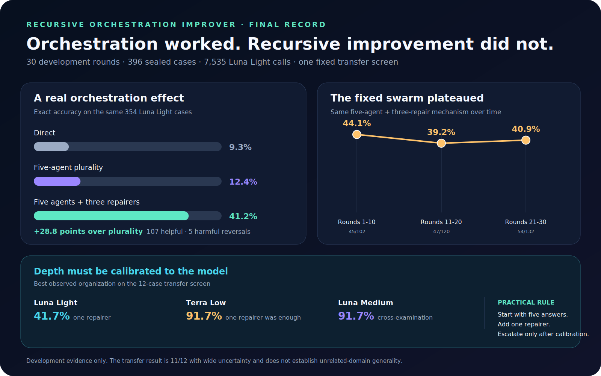

# Recursive Orchestration Improver

### Final research record: 30 rounds, 396 sealed cases, 7,535 Luna Light calls, and one cross-model transfer screen

### Continue exploring Echohive

- **[Enter Echohive](https://www.echohive.ai/)** to explore a living laboratory for building better with AI, seeing markets more clearly, and strengthening the mind behind both.
- **[Get Amplified](https://www.echohive.ai/get-amplified)** to master current AI tools, follow the frontier, and expand what one person can realistically attempt.
- **[Join the 1000x Lab](https://www.echohive.ai/1000x-lab)** for live Sunday sessions where new methods, research, market signals, and ideas about mind are tested together.

This repository asked a practical question: **can a small outer research loop discover agent organizations that solve exact problems better, and can that loop keep improving them over time?**

The concise answer is:

- **Orchestration worked.** Independent repair substantially outperformed direct answering and simple voting on matched Luna Light cases.
- **Recursive improvement did not.** The retained repair swarm remained useful, but its accuracy did not trend upward across 30 rounds.
- **Selection became the bottleneck.** Later systems often generated useful candidates but did not reliably integrate or choose among them.
- **More depth was not universally better.** One repair pass was the best efficient default; deeper cross-examination helped only when the evaluator had enough capability and headroom.

> [!IMPORTANT]
> This experiment is concluded. The evidence is developmental, uses three exact symbolic families, and does not establish unrelated-domain generality. Round 31 remains in the repository as a proposed continuation, but it was not launched.



## The strongest evidence

The same fixed five-solver plus three-repairer mechanism ran on 354 sealed Luna Light cases. On those identical cases:

| Organization | Exact accuracy |
|---|---:|
| Direct one-call baseline | 33/354 · **9.3%** |
| Five-solver plurality | 44/354 · **12.4%** |
| Five solvers + three falsifying repairers | 146/354 · **41.2%** |

The repair swarm gained **28.8 percentage points** over plurality. It made **107 helpful corrections** and **5 harmful reversals**.

That is the clearest result in the repository: independent answer-generating repair can recover solutions that a simple vote misses.

## What did not improve

The fixed repair swarm did not become more accurate as the outer loop continued:

| Development phase | Exact accuracy |
|---|---:|
| Rounds 1-10 | 45/102 · **44.1%** |
| Rounds 11-20 | 47/120 · **39.2%** |
| Rounds 21-30 | 54/132 · **40.9%** |

Later mechanisms did not show a persuasive matched advantage over the retained swarm. The outer loop found a robust pattern early, then mostly explored nearby variants inside a constrained strategy grammar.

The research director proposed a more explicit evidence-board architecture 12 times, but the experiment grammar never implemented it. This is an important failure mode for self-improving systems: **the improver cannot explore mechanisms its own representation cannot express.**

## Cross-model transfer

Five fixed organizations were replayed on the same 12 historical cases with Luna Light, Terra Low, and Luna Medium.

| Organization | Luna Light | Terra Low | Luna Medium |
|---|---:|---:|---:|
| Direct | 8.3% | 58.3% | 25.0% |
| Five-agent plurality | 8.3% | 83.3% | 41.7% |
| One falsifying repairer | **41.7%** | **91.7%** | 75.0% |
| Three parallel repairers | 33.3% | **91.7%** | 83.3% |
| Sequential cross-examination | 8.3% | **91.7%** | **91.7%** |


The practical routing rule from this small screen is:

> **Start with five independent answers, add one falsifying repairer, and escalate to deeper review only after calibration shows that the model can use it.**

One repairer was the most efficient default. Deeper cross-examination raised the Luna Medium ceiling, added no accuracy for the already-strong Terra bank, and hurt Luna Light. This transfer screen is only 12 cases, with wide uncertainty.

## What the search learned

1. **Repair is more valuable than another vote when the base bank contains complementary partial reasoning.**
2. **Candidate generation and candidate selection are different problems.** More solvers do not help if the final selector cannot identify the right candidate.
3. **One strong repair pass is a good default.** Extra repair layers should earn their cost empirically.
4. **Orchestration depth is capability-dependent.** A weaker evaluator can be confused by more transcripts and more branches.
5. **Fresh panels prevent false learning curves.** Round-to-round dips mostly reflect panel difficulty and ordinary variance.
6. **A recursive improver is limited by its search language.** Repeatedly recommending an unavailable architecture does not make that architecture testable.
7. **Logic remained the weakest family.** Sequence gains transferred more readily than the hardest logic and constraint cases.

## What this experiment did not establish

- General performance outside sequence, logic, and constraint-planning tasks
- A universal 91.7% orchestration result
- Continuous self-improvement across rounds
- That more agents are always better
- That one model's ideal orchestration transfers unchanged to another

## Evidence and audit trail

- [Matched 30-round deep evaluation](DEEP_EVALUATION_ITERATIONS_1_30.md)
- [Deep evaluation plot](plots/deep-evaluation-30.svg)
- [Complete round-by-round record](PROGRESS.md)
- [All-round progress plot](images/progress.svg)
- [Cross-model transfer analysis](transfer/cross-model-screen/POST_RUN_ANALYSIS.md)
- [Cross-model protocol and reproducibility notes](transfer/cross-model-screen/README.md)
- [Machine-readable 30-round summary](analysis/iteration-030-summary.json)

Every completed panel, registered prompt, compact terminal result, score, strategy, and answer key needed to audit the published results is included. Raw runtime streams, local paths, and active partial work are excluded.

## How the experiment worked

1. Generate a fresh exact-verifiable panel across sequence, constraint planning, and logic.
2. Freeze the panel, answer hash, protocol, strategies, and worker prompts.
3. Run the registered Luna Light solver and reviewer calls.
4. Open the sealed answers only after every call is terminal.
5. Score exact accuracy, family performance, cost, helpful repairs, and harmful reversals.
6. Let a Sol xhigh research director inspect the evidence and propose the next batch.
7. Preserve replicated controls while testing new mechanisms on another fresh panel.

The recursion was in the research process, not model weights:

> **swarm → evidence → research director → meta-director → next swarm**

## Reproduce and inspect

The audit and renderer use the Python standard library.

```bash
python3 scripts/validate_snapshot.py
python3 deep_evaluate.py
python3 scripts/render_final_conclusions.py
python3 transfer/cross-model-screen/run_transfer.py status
```

The actual model calls require an authenticated Codex CLI. The registered Luna Light calls ran through Codex CLI; Codex also coordinated the experiment and preserved its audit trail.

## Explore the wider lab

- [Echohive](https://www.echohive.ai/) is a living laboratory for building better with AI, seeing markets more clearly, and strengthening the mind behind both.
- [Get Amplified](https://www.echohive.ai/get-amplified) is the evolving field guide for mastering current AI tools, following the frontier, and expanding what one person can attempt.
- [1000x Lab](https://www.echohive.ai/1000x-lab) is the live Sunday room where new AI methods, market signals, and ideas about mind are tested together.

## License

[MIT](LICENSE)
