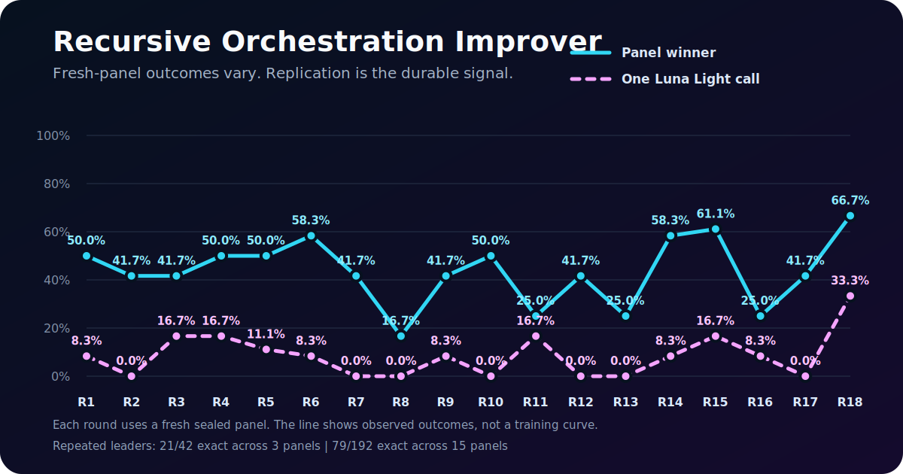
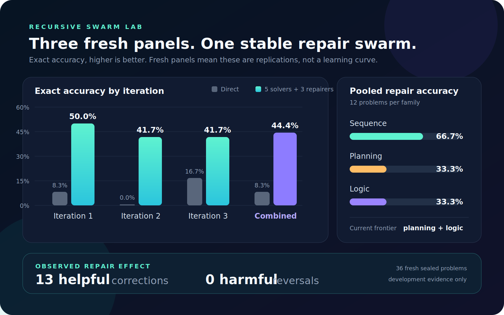

# Recursive Orchestration Improver

### A self-improving search for better agent orchestration

What happens when independent AI solvers are allowed to disagree, then a second group tries to repair their answers instead of merely judging them?

Recursive Orchestration Improver is a small, reproducible auto-research system that searches for domain-neutral ways to organize agents. Luna Light workers solve fresh, sealed sequence, planning, and logic problems. A Sol research director studies the results and proposes the next orchestration batch. A human-guided Codex agent remains the meta-director, improving both the search direction and the improver itself.

The recursion is in the research process, not the model weights: each completed experiment changes how the next swarm is designed, while fresh panels test whether those changes actually help.

> [!IMPORTANT]
> **This is active research, not a finished benchmark.** The repository currently contains 5 completed research rounds and the registered strategy for Round 6. The numbers below are promising development evidence, not independent final validation.

## Explore the wider lab

- [Echohive](https://www.echohive.ai/) is the living laboratory where these systems, experiments, and ideas are built in public.
- [Get Amplified](https://www.echohive.ai/get-amplified) is a practical field guide for using current AI models, agents, and harnesses to attempt larger work.
- [1000x Lab](https://www.echohive.ai/1000x-lab) is the live Sunday session where new methods, research, and experiments are worked through together.

<!-- LIVE_PROGRESS_START -->
## Live research progress

**5 completed rounds.** The latest winner was **Nine Solvers plus Three Falsifying Repairers**, which solved **9/18 (50.0%)** with a weakest-family accuracy of **33.3%**.

| Round | Best registered system | Exact accuracy | Weakest family | Direct baseline | Worker calls |
|---:|---|---:|---:|---:|---:|
| 1 | Five Solvers plus Three Repairers | 6/12 · **50.0%** | 25.0% | 1/12 · 8.3% | 252 |
| 2 | Five Solvers plus Three Repairers | 5/12 · **41.7%** | 25.0% | 0/12 · 0.0% | 273 |
| 3 | Five Solvers plus Three Repairers | 5/12 · **41.7%** | 25.0% | 2/12 · 16.7% | 228 |
| 4 | Nine Solvers plus Three Falsifying Repairers | 6/12 · **50.0%** | 50.0% | 2/12 · 16.7% | 246 |
| 5 | Nine Solvers plus Three Falsifying Repairers | 9/18 · **50.0%** | 33.3% | 2/18 · 11.1% | 480 |



[Read the round-by-round progress notes](PROGRESS.md)

> [!NOTE]
> Every point uses a different fresh sealed panel. This is an honest sequence of research outcomes, not a conventional training curve. Final performance still requires a frozen system and untouched validation.
<!-- LIVE_PROGRESS_END -->

## Initial repair signal (Rounds 1-3)

One stable system appeared in all three completed iterations:

> **Five independent solvers → three independent answer-generating repairers → deterministic repair plurality, with base plurality as fallback**

| Fresh panel | Direct answer | Five-vote plurality | Repair swarm | Helpful repairs | Harmful repairs |
|---|---:|---:|---:|---:|---:|
| Iteration 1 | 1/12 · 8.3% | 1/12 · 8.3% | **6/12 · 50.0%** | 5 | 0 |
| Iteration 2 | 0/12 · 0.0% | 0/12 · 0.0% | **5/12 · 41.7%** | 5 | 0 |
| Iteration 3 | 2/12 · 16.7% | 2/12 · 16.7% | **5/12 · 41.7%** | 3 | 0 |
| **Combined** | **3/36 · 8.3%** | **3/36 · 8.3%** | **16/36 · 44.4%** | **13** | **0** |



Across these 36 fresh problems, the repair swarm solved over five times as many cases as either simple baseline. Its pooled accuracy was strongest on sequences at 66.7%, while planning and logic each reached 33.3%.

That does **not** mean performance improved from 50.0% to 41.7% to 41.7%. Every iteration used a different sealed panel. The three points are replications on new small samples, not a learning curve.

## How the loop works

1. Generate a fresh exact-verifiable panel with four sequence, four planning, and four logic cases.
2. Freeze the panel, answer hash, protocol, strategies, and every worker prompt before execution.
3. Run the registered Luna Light solver and reviewer calls.
4. Open the sealed answers only after all worker calls are terminal.
5. Score exact and partial accuracy, family performance, cost, helpful repairs, and harmful reversals.
6. Let a Sol xhigh research director diagnose the evidence and propose the next small batch.
7. Preserve fixed controls and the current winner while testing new mechanisms on another fresh panel.

That creates a compact recursive loop:

> **swarm → evidence → research director → meta-director → improved swarm**

Only infrastructure failures are retried. Valid but wrong, malformed, or protocol-violating outputs are kept as outcomes. The answer key is never included in a worker prompt.

## What appears interesting so far

- Independent repair can add answers that were absent from the original solver bank.
- More voters did not reliably improve plurality. Candidate availability and answer selection are different problems.
- A repair layer helped on 13 observed cases without an observed harmful reversal in this system.
- More elaborate variants were not automatically better. In Iteration 3, five repairers reached 25%, while a smaller one-anchor plus three-rederiver system reached 33.3% at half the calls per problem.
- Sequence performance is encouraging, but planning and logic remain weak. Those families are the current frontier.

The zero-harm observation should be interpreted cautiously. Correct base answers were uncommon, so there were relatively few opportunities to measure harmful reversals.

## What is still unknown

- Whether the result survives a larger untouched validation set
- Whether it transfers beyond the three exact symbolic families used for development
- Whether repair remains beneficial when the base model is already frequently correct
- Whether similar gains can be achieved with fewer than eight calls per problem

No system should be called general until it is frozen and tested on genuinely different, untouched problem families.

## Repository map

```text
run.py                         resumable experiment runner and scorer
protocol.json                  models, budgets, sealing, retries, and selection
researcher.md                  seed for the Sol research director
scripts/                       panel generator and safe public-snapshot exporter
strategies/                    exact strategy batch registered for each iteration
iterations/iteration-00N/
  panel/                       public cases, completed answer key, and hashes
  base/jobs.jsonl              every registered base prompt
  base/results.jsonl           every compact terminal base result
  review/jobs.jsonl            every registered review prompt
  review/results.jsonl         every compact terminal review result
  director/                    prompt, request registration, and proposal
  results/                     case-level scores, summary, CSV, and plot
images/                        cross-iteration explanatory chart
```

Completed answer keys are public so the results can be audited. The active panel and partial outputs for the next round are intentionally absent. Its strategy file is included to show the registered research direction without leaking or freezing a mid-run result.

## Run it

The runner and generator use only the Python standard library. An authenticated Codex CLI with access to the configured models is required for actual model calls.

```bash
python3 scripts/validate_snapshot.py
python3 run.py status
python3 run.py one
```

`python3 run.py loop` continues until a file named `STOP` is present or the process receives an interrupt. Review model names, service tier, concurrency, and budgets in `protocol.json` before launching calls.

## License

[MIT](LICENSE)
