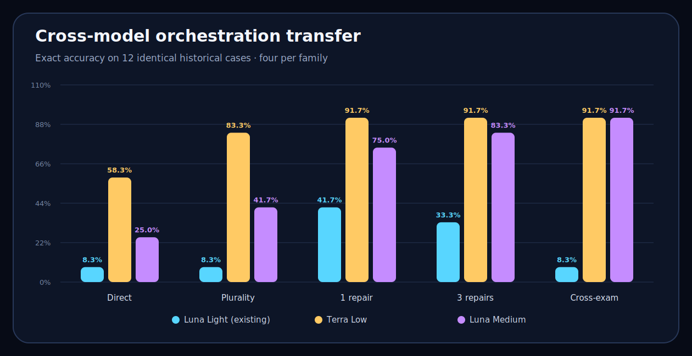

# Cross-Model Orchestration Transfer Results

This fixed screen compares existing Luna Light results with new Terra Low and Luna Medium calls on the same 12 historical cases. It is a model-transfer screen, not independent domain validation.

- New worker calls: **274**
- Cases: **12**, balanced four per family
- Adaptive changes after registration: **none**

| Method | Luna Light | Terra Low | Luna Medium |
| --- | ---: | ---: | ---: |
| Direct One | 1/12 (8.3%) | 7/12 (58.3%) | 3/12 (25.0%) |
| Five-Vote Plurality | 1/12 (8.3%) | 10/12 (83.3%) | 5/12 (41.7%) |
| One-Review Five-Bank Falsifying Repair | 5/12 (41.7%) | 11/12 (91.7%) | 9/12 (75.0%) |
| Three-Review Five-Bank Falsifying Repair | 4/12 (33.3%) | 11/12 (91.7%) | 10/12 (83.3%) |
| Sequential Five-Bank Cross-Examination | 1/12 (8.3%) | 11/12 (91.7%) | 11/12 (91.7%) |

## Lift over five-vote plurality

**Luna Light (existing)**

- One-Review Five-Bank Falsifying Repair: **+33.3 points**
- Three-Review Five-Bank Falsifying Repair: **+25.0 points**
- Sequential Five-Bank Cross-Examination: **+0.0 points**

**Terra Low**

- One-Review Five-Bank Falsifying Repair: **+8.3 points**
- Three-Review Five-Bank Falsifying Repair: **+8.3 points**
- Sequential Five-Bank Cross-Examination: **+8.3 points**

**Luna Medium**

- One-Review Five-Bank Falsifying Repair: **+33.3 points**
- Three-Review Five-Bank Falsifying Repair: **+41.7 points**
- Sequential Five-Bank Cross-Examination: **+50.0 points**

## Interpretation boundary

Twelve cases can reveal large directional effects but cannot distinguish small performance differences reliably. Historical cases permit exact cross-model matching, but the mechanisms were developed within this task distribution. Unrelated-domain validation remains separate.

